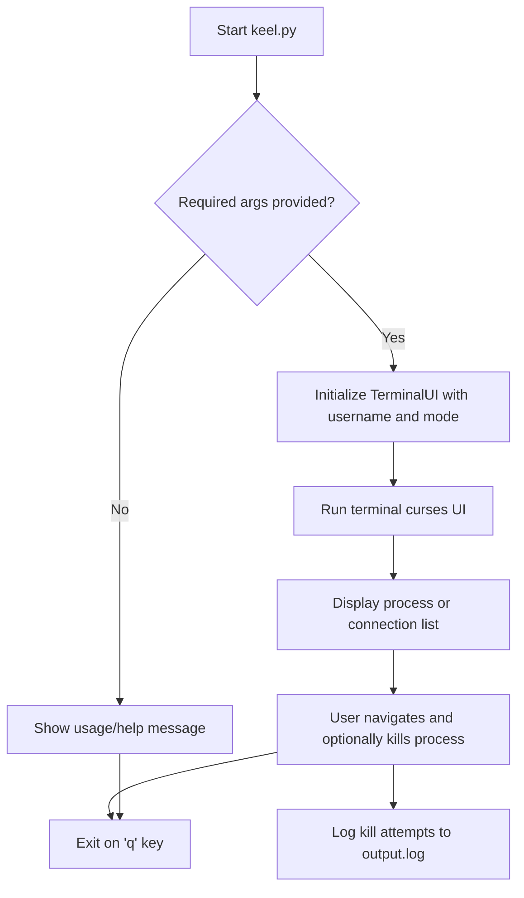

# Quick Validation Steps

This guide leads you through essential checks to confirm keel is installed correctly and operating as expected. From verifying dependencies to observing the running process list, these quick validation steps reduce uncertainty early on, helping you build confidence in your setup.

---

## 1. Confirm Dependency Installation

Before launching keel, ensure the key dependencies are installed and compatible.

### Steps:
1. Verify Python 3 installation:

   ```bash
   python3 --version
   ```

   - Expected: Python 3.x.x (version 3.6 or newer recommended)

2. Verify `psutil` library is installed:

   ```bash
   python3 -m pip show psutil
   ```

   - Expected: Display package details like Name, Version

3. Confirm terminal supports `ncurses` (usually pre-installed on Unix-like systems).

   - You can test basic curses support by running a simple Python curses example or proceeding to launch keel.

<Tip>
If `psutil` is missing, install it via:

```bash
pip install psutil
```

If Python 3 is not found, install or configure your environment accordingly.
</Tip>

---

## 2. Verify keel Installation

Check that keel is installed and accessible for execution.

### Steps:
1. If installed via pip, check by running:

   ```bash
   pip show keel
   ```

   - Expected: Package information showing keel installed version.

2. If using source code, ensure you have access to the `keel.py` file and dependencies.

3. Check that you can access `keel.py` and invoke help:

   ```bash
   python3 keel.py -h
   ```

   - Expected: Help message showing usage details with parameters `-u` (username) and `-m` (mode).

<Tip>
Review installation troubleshooting docs if keel does not appear installed or accessible.
</Tip>

---

## 3. Validate Command-Line Parameters and Launch

Run keel with required parameters and observe system response.

### Steps:
1. Choose a valid username on your system, or omit to let keel use `root` by default.

2. Select mode:
   - `regular`: Lists processes owned by the user.
   - `connections`: Lists open network connections.

3. Run keel with example command:

   ```bash
   python3 keel.py -u your_username -m regular
   ```

   Replace `your_username` with the actual system user.

4. Observe that the terminal UI launches with a centered title indicating mode and user.

5. Confirm the listing of processes or connections appears.

6. Try navigating with arrow keys and kill a highlighted process by pressing `Enter`.

<Tip>
Press `q` to exit the application safely.
</Tip>

<Warning>
Running keel as non-root users may limit the visibility of some processes depending on system permissions.
</Warning>

---

## 4. Observe Process List and Interaction

Ensure the listed processes or network connections are accurate and responsive.

### Steps:

1. Confirm that processes shown belong to the specified user when in `regular` mode.

2. In `connections` mode, verify that network connections appear correctly, including TCP or UDP sockets.

3. Test navigation:
   - Use arrow keys (`Up`/`Down`) to move the cursor.
   - Confirm highlight moves accordingly.

4. Kill a process by selecting it and pressing `Enter`. Check the process exits.

5. Confirm logs (if enabled) appear in `output.log` in the current directory to verify actions like kill attempts.

---

## 5. Verify Process Termination Logging

Confirm keel logs process kill attempts appropriately, helping track actions.

### Steps:

1. Locate `output.log` in your working directory.

2. Open and inspect for entries similar to:

   ```text
   INFO:root:Killing PID: 1234 with name: some_process
   ```

3. Verify log entries correspond with your manual kill operations.

---

## 6. Troubleshooting Common Validation Scenarios

If any steps above do not complete as expected, consider these checks:

<AccordionGroup title="Common Issues and Solutions">
<Accordion title="No Python 3 detected">
Ensure Python 3 is installed and set in your system PATH. Try `python3` or `python` commands to verify.
</Accordion>
<Accordion title="Missing or incompatible psutil">
Run `pip install psutil`. Verify with `pip show psutil`. Use a compatible Python 3 version.
</Accordion>
<Accordion title="Terminal UI does not launch or shows errors">
Check if your terminal supports ncurses and that `curses` library is working correctly. Some Windows terminals may require WSL or a compatible environment.
</Accordion>
<Accordion title="Empty process list or no output">
Ensure the specified user exists and has running processes. Try running with `root` if permissions are limited.
</Accordion>
<Accordion title="Unable to kill processes">
Ensure you have sufficient privileges to terminate processes. Some processes may be protected or require root permissions.
</Accordion>
</AccordionGroup>

---

## 7. What’s Next?

After completing these quick validation steps with success, you're ready to:

- Explore the full usage guide on [First Successful Run](../first-run-validation/first-successful-run.md) to understand all controls and workflows.
- Learn detailed installation steps if you haven't already via [Installation & Dependencies](../../keel-overview/integration-getting-started/installation-dependencies.md).
- Dive into troubleshooting common issues at [Troubleshooting Common Issues](../first-run-validation/troubleshooting-common-issues.md).

<Check>
Confirming these validation steps ensures a smooth keel experience.
</Check>

---

## Additional Tips

- Always run keel in a terminal emulator that supports keyboard input and ANSI colors.
- Use the logging file `output.log` to review your session’s actions.
- Prefer running keel with the least privilege necessary to avoid security risks.

---

## Summary Diagram: keel Startup and Validation Flow



This simplified flow shows the practical runtime path you validate when performing these quick steps.

---

## References

- [First Successful Run - Detailed Usage](../first-run-validation/first-successful-run.md)
- [Installation & Dependencies](../../keel-overview/integration-getting-started/installation-dependencies.md)
- [Troubleshooting Common Issues](../first-run-validation/troubleshooting-common-issues.md)
- [keel GitHub Repository](https://github.com/modelorona/keel)


---

For any issues during these checks, consult the linked troubleshooting guide or raise an issue in the [GitHub repo](https://github.com/modelorona/keel/issues).

---

Thank you for validating your keel installation and setup. You are now on your way to efficient process management with keel.