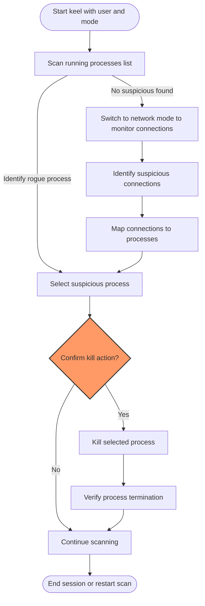

# Common Defensive Administration Scenarios

## Overview
This guide helps system administrators, security operators, and cyber defense teams master practical workflows using *keel* to rapidly identify and respond to suspect processes and anomalous service behavior. Leveraging keel’s unified terminal interface, users can streamline threat hunting, service anomaly isolation, and incident response — all without juggling multiple terminal windows or complex commands. This document walks you through real-world tasks with clear, actionable steps to achieve fast, confident control.

---

## Prerequisites

- keel installed and accessible via Python 3 environment
- Basic knowledge of terminal navigation and process concepts (PID, username, process listing)
- Permission to terminate processes on the system
- keel launched with appropriate user and mode parameters (see [Configuration & Initial Setup](/getting-started/setup-installation/configuration-setup))

---

## Expected Outcomes

By following this guide, you will be able to:
- Quickly spotlight rogue or unintended processes infringing system policies
- Drill down to processes related to specific service anomalies
- Terminate suspicious processes safely and efficiently
- Respond to live incidents without interrupting normal workflow

---

## Time Estimate

Typical scenario workflows can be completed within 5 to 15 minutes depending on system load and complexity of investigation.

---

## Difficulty Level

Intermediate — Basic familiarity with process management and terminal tools is expected.

---

## 1. Identify Rogue Processes Rapidly

### Objective
To detect and terminate unauthorized or suspicious processes swiftly, minimizing security risk or resource strain.

### Steps

1. **Launch keel targeting your user or root**
   ```bash
   python3 keel.py -u root -m regular
   ```
   This displays all processes owned by root.

2. **Navigate the process list**
   - Use arrow keys to move up and down the list.
   - Observe the "pid : name" format highlighting running processes.

3. **Spot processes that are unexpected or abnormal**
   - Look for unfamiliar process names or unusual resource consumption (if additional monitoring tools are used).
   - If you know a forbidden process name, use system search or visually locate it.

4. **Select the suspicious process**
   - Move the cursor to highlight the target.

5. **Terminate safely**
   - Press [Enter] to kill the highlighted process.
   - keel will confirm termination and remove it from the list.

6. **Verify**
   - Confirm the process entry disappears and the process no longer runs (optional: verify with external commands or tools).

### Tips
- Confirm you do not kill critical system processes indicated by user and name.
- Always verify process identity before kill to avoid system instability.

---

## 2. Isolate Service Anomalies

### Objective
Focus on processes related to a specific service or user to troubleshoot issues like performance degradation or suspicious behavior.

### Steps

1. **Launch keel filtering by the user owning the targeted service**
   ```bash
   python3 keel.py -u serviceuser -m regular
   ```

2. **Scan the process list for service-related processes**

3. **Use incremental navigation to inspect individual PIDs**

4. **Terminate or restart specific processes as needed**
   - Highlight any aberrant processes and press [Enter] to terminate.

5. **Switch modes if needed to verify network activity related to the service**
   - Relauch keel with `-m connections` to check active network connections:  
     ```bash
     python3 keel.py -u serviceuser -m connections
     ```
   - Identify suspicious established connections and consider closing related processes.

### Tips
- Use the mode switch feature strategically for faster insight on connection vs process anomalies.
- Document critical PIDs and timestamps during incident investigation to support audit trails.

---

## 3. Incident Response in a Single Terminal Window

### Scenario
During active incidents requiring immediate containment, use keel to gain central control.

### Steps

1. **Start keel as root in regular process mode**
   - Command:
     ```bash
     python3 keel.py -u root -m regular
     ```

2. **Scan for newly spawned or high-risk processes**

3. **Kill suspect processes instantly with [Enter] key press**

4. **Switch modes on the fly if support for in-session mode change exists (planned)**

5. **Monitor connections for abnormal established endpoints**

6. **Repeat scanning and administration cycles without leaving the interface**

### Tips
- Maintain calm and confirm each termination since live incident environments are sensitive.
- Use background system logging if available for forensic analysis.

---

## Common Pitfalls & Troubleshooting

<AccordionGroup title="Common Pitfalls & Solutions">
<Accordion title="Empty Process List After Launch">
- Ensure that the username parameter (-u) is valid and has running processes.
- Running with root user often shows all system processes.
- Verify dependencies like psutil are installed.
</Accordion>
<Accordion title="Unable to Kill Process">
- Check permissions; killing processes may require elevated privileges.
- keel protects itself by refusing to kill its own process.
- Examine error logs for details.
</Accordion>
<Accordion title="Navigation Issues">
- Use arrow keys correctly; terminal settings may impact key recognition.
- Confirm terminal supports ncurses.
- Resize terminal window if display cutoff occurs.
</Accordion>
</AccordionGroup>

---

## Best Practices

- Always launch keel with appropriate user context to avoid unnecessary permission errors.
- Start in regular mode for process overview and switch mode for connection details as needed.
- Use process names and user filters to narrow focus quickly.
- Avoid killing essential system processes to maintain stability.

---

## Next Steps & Related Content

- [Installation & Dependencies](/keel-overview/integration-getting-started/installation-dependencies) for setup guidance.
- [Configuration & Initial Setup](/getting-started/setup-installation/configuration-setup) to understand parameters.
- [Viewing and Navigating Processes](/guides/core-workflows/view-processes) for foundational UI navigation.
- [Killing Processes Safely](/guides/core-workflows/kill-process) for deeper process termination techniques.
- [Filtering Processes by User](/guides/advanced-usage/filter-by-user) to focus investigations.
- [Switching Between Network and System Modes](/guides/advanced-usage/network-vs-system-mode) for understanding modes.

---

## Summary Diagram of Defensive Workflow



---

This workflow empowers users to maintain control and visibility over their systems efficiently using keel’s single terminal interface.

---