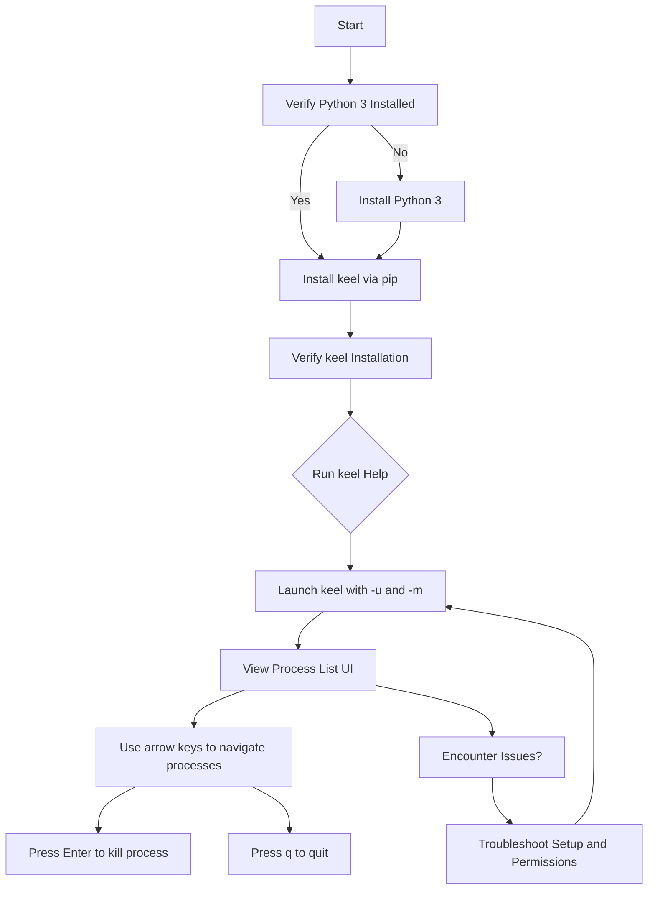

# Installing and Launching keel

A quickstart guide designed to get you from installing keel to running it for the first time, seeing a live process list on your terminal in just minutes. This guide assumes minimal prior knowledge and helps you seamlessly set up everything needed and launch keel smoothly.

---

## 1. Overview

### What This Guide Helps You Accomplish
You will learn how to:
- Install keel and all its dependencies
- Set up your environment for running keel
- Launch the keel program with required parameters
- View and interact with a live terminal UI showing your system's process list

### Prerequisites
- Python 3 installed on your system
- Basic command-line familiarity
- Access permissions necessary to view and kill processes

### Expected Outcome
By following this guide, you will have keel installed and running in a terminal window, displaying processes for a specified user or all users, with the ability to navigate and kill processes easily.

### Time Commitment
Around 10-15 minutes for installation and initial launch.

### Difficulty Level
Beginner-friendly with step-by-step instructions.

---

## 2. Step-by-Step Instructions

### Step 1: Confirm Python 3 Installation
Open your terminal and run:

```bash
python3 --version
```

You should see a Python 3 version output. If not installed, download and install Python 3 from your package manager or [python.org](https://www.python.org/downloads/).

### Step 2: Install keel via pip

keel is distributed on PyPI, making installation quick with pip. Run:

```bash
pip install keel
```

This installs keel and its dependencies automatically.

If you don’t have `pip`, install it for Python 3 or use your system package manager.

### Step 3: Verify keel Installation
After installation, confirm keel exists:

```bash
python3 -m keel -h
```

You should see keel’s help output showing usage instructions and available parameters.

### Step 4: Understand Required Parameters
keel requires two parameters to run:
- `-u` or `--username`: specify the username whose processes you want to monitor.
- `-m` or `--mode`: specify the mode, either `regular` (system processes) or `connections` (network connections).

Example usage:

```bash
python3 -m keel -u root -m regular
```

### Step 5: Launch keel
Run keel with your chosen username and mode:

```bash
python3 -m keel -u yourusername -m regular
```

or for network connections mode:

```bash
python3 -m keel -u yourusername -m connections
```

Replace `yourusername` with your system username or the user whose processes you want to manage.

### Step 6: Interacting with keel
Once launched, keel will show a process list in your terminal:
- Use **arrow keys** to navigate up and down the process list.
- The highlighted process is the current selection.
- Press **Enter** to kill the highlighted process.
- Press **q** to quit keel.

### Step 7: Troubleshooting Common Launch Issues
If you see an empty list:
- Verify the username exists and has running processes.
- Check for permission issues (try running with elevated privileges).

If keel exits immediately:
- This may happen if no processes are found for the user.

If you get errors on missing dependencies:
- Ensure you have Python 3 and psutil installed.
- Reinstall keel if necessary.

---

## 3. Practical Tips and Best Practices

- Always confirm the username you want before launching to avoid killing unintended processes.
- Use `regular` mode to manage system/user processes and `connections` mode to view network connections.
- Killing a process requires permissions; run keel as a user with the necessary rights.
- If unsure, try running keel as root for full visibility and control.
- Monitor your terminal window size; resizing during operation may cause display glitches.

---

## 4. Examples

### Example: Launch keel for your current user in regular mode

```bash
python3 -m keel -u $(whoami) -m regular
```

This shows your processes, allowing you to navigate and kill any if needed.

### Example: Launch keel to monitor network connections for root

```bash
python3 -m keel -u root -m connections
```

This shows open TCP/UDP connections in a similar navigable list.

---

## 5. Next Steps

- After successfully launching keel, see the [Viewing and Navigating Processes guide](/guides/core-workflows/view-processes) for detailed UI navigation.
- Learn how to safely kill processes effectively in [Killing Processes Safely](/guides/core-workflows/kill-process).
- Explore advanced features such as filtering by user and switching modes in the advanced usage guides.

---

## 6. Additional Resources
- Full installation details and dependency info: [Installation & Dependencies](/keel-overview/integration-getting-started/installation-dependencies)
- Prerequisites and system requirements: [Prerequisites & System Requirements](/getting-started/setup-installation/prerequisites-requirements)
- Configuration and parameters explained: [Configuration & Initial Setup](/getting-started/setup-installation/configuration-setup)
- Help and troubleshooting for first runs: [First Successful Run](/getting-started/first-run-validation/first-successful-run) and [Troubleshooting Common Issues](/getting-started/first-run-validation/troubleshooting-common-issues)

---

<Tip>
Run `python3 keel.py -h` or `python3 -m keel -h` anytime to see the latest usage help and available options.
</Tip>

<Note>
Be aware keel is under active development; some features may not yet be fully functional.
</Note>

---

# Summary Diagram of Installation to Launch Workflow


---

This diagram outlines the practical flow from installation through a successful keel launch, highlighting key checkpoints and decision points.

---

## References
- [keel GitHub Repository](https://github.com/modelorona/keel)
- [Installation & Dependencies Overview](/keel-overview/integration-getting-started/installation-dependencies)
- [Configuration & Initial Setup](/getting-started/setup-installation/configuration-setup)
- [First Successful Run](/getting-started/first-run-validation/first-successful-run)


