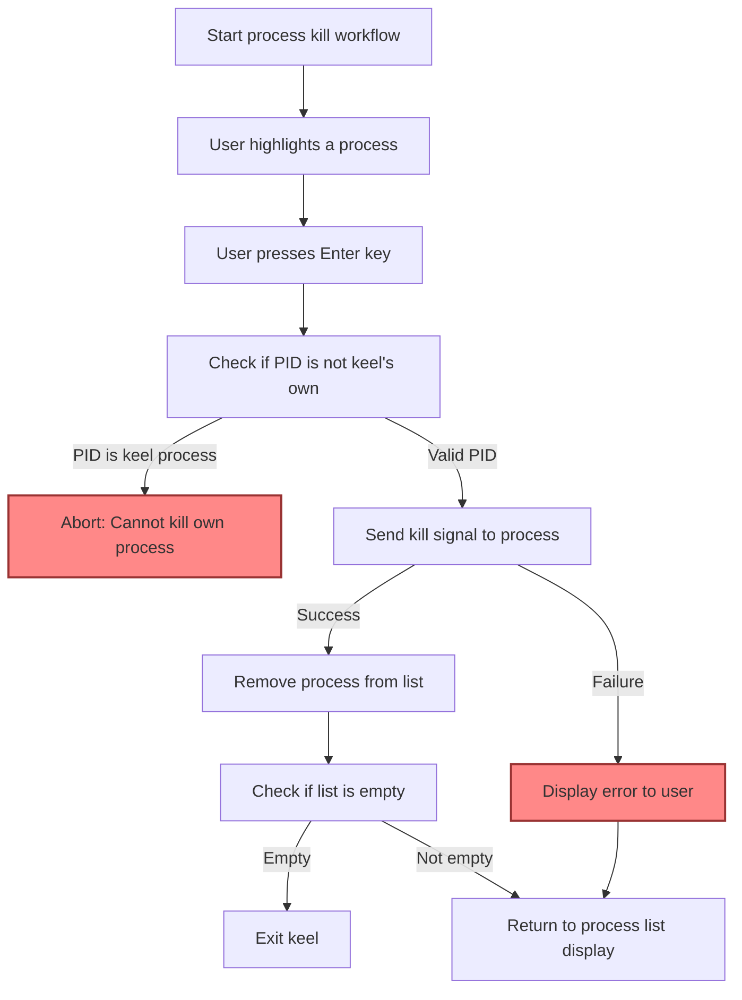

# Killing Processes Safely

A practical guide to selecting and safely terminating processes using keel’s intuitive interface. Learn how to navigate the process list, highlight the desired process, and kill it using the enter key while understanding the implications and best practices to maintain system stability and security.

---

## 1. Understanding the Kill Process Workflow

### What This Guide Helps You Achieve
This guide helps you confidently select and terminate system processes within keel’s terminal-based UI. You will learn how to navigate the process list, use keyboard controls for selection, safely execute process termination, and understand the consequences of killing processes.

### Prerequisites
- keel installed and successfully launched with appropriate username and mode parameters.
- Basic familiarity with keel’s UI navigation (see [Viewing and Navigating Processes](../guides/core-workflows/view-processes)).
- Necessary permissions to kill processes owned by the specified user.

### Expected Outcome
- You will be able to navigate the process list, highlight the target process, and kill it using the enter key.
- Understand the safety considerations and system effects of killing processes.
- Avoid common pitfalls such as terminating critical system processes or your own session.

### Time Required
Approximately 5-10 minutes for a first successful process termination.

### Difficulty Level
Beginner to Intermediate

---

## 2. Step-by-Step Guide to Killing Processes Safely

<Steps>
<Step title="Launch keel with Correct Parameters">
Run keel specifying your username and operation mode ('regular' to manage normal processes).

**Example:**
```bash
python3 keel.py -u yourusername -m regular
```

**Expected Result:** The terminal UI launches showing processes owned by the specified user.

**Note:** If unsure, refer to configuration and setup guides for usage details.
</Step>

<Step title="Navigate the Process List">
Use the arrow keys to move the highlight (reverse video) up and down the list.

- Down Arrow: Move selection down
- Up Arrow: Move selection up

**Expected Result:** The highlighted line indicates the currently selected process.

**Tip:** The interface prevents moving beyond listed items and handles scrolling automatically.
</Step>

<Step title="Identify the Process to Kill">
Look for the target process in the format:

```pid : process_name```

Confirm you are selecting the correct process by verifying the PID and name.

**Warning:** Avoid killing system critical processes or those that you do not recognize.
</Step>

<Step title="Terminate the Selected Process">
Press the **Enter** key while the process is highlighted.

**What Happens:**
- keel sends a kill signal to the process with the selected PID.
- If successful, the process is removed from the list.

**Expected Result:** Process no longer appears in the list; system resource related to that process is freed.

**If Failed:** keel logs errors (e.g., no permission, process does not exist).
</Step>

<Step title="Verify Process Termination">
Observe the list updates immediately to exclude the killed process.

If the process still appears, you may lack permissions, or the process respawned.

**Tip:** Use system commands like `ps` or `top` separately to verify process status.
</Step>

<Step title="Exit keel Safely">
Press **q** to quit the application once you finish your session.

**Expected Result:** The UI closes, and you return to your normal command prompt.
</Step>
</Steps>

---

## 3. Practical Examples

### Example: Killing a Hanging Browser Process
1. Launch keel for your user:
```bash
python3 keel.py -u alice -m regular
```
2. Scroll down until you find:
```
1234 : firefox
```
3. Highlight this line using arrow keys.
4. Press **Enter** to kill the firefox process.

Result: The process is terminated, freeing memory and CPU.

### Example: Killing a Service Process
1. Identify the PID of the service you want to stop.
2. Ensure you have permission to kill the service.
3. Use keel, select the process, and press enter.

**Note:** If the service restarts automatically, consider service management tools instead.

---

## 4. Troubleshooting and Best Practices

<AccordionGroup title="Common Issues & Solutions">
<Accordion title="Process Does Not Disappear After Killing">
- The process may have spawned child processes or restarted automatically.
- Confirm the process is actually killed by checking system tools (`ps`, `htop`).
- You might lack sufficient permission; try running keel with a user that has required privileges.
</Accordion>

<Accordion title="Unable to Kill a Process - Permission Denied">
- Ensure you have the necessary system privileges.
- Consider running keel as `root` if administratively appropriate.
- Avoid killing critical processes unless absolutely necessary.
</Accordion>

<Accordion title="Killed the Current keel Process by Accident">
- keel prevents killing its own PID and throws an error.
- If this happens accidentally, restart keel.
</Accordion>
</AccordionGroup>

<Tip>
Always verify the process you are killing to avoid unintended system disruptions.
</Tip>

<Warning>
Killing system or critical processes may cause system instability or data loss. Proceed with caution and have backups or recovery plans.
</Warning>

---

## 5. Next Steps & Related Documentation

- To learn how to filter and view processes by different users, see [Filtering Processes by User](../guides/advanced-usage/filter-by-user).
- Explore switching between network connections and process mode in [Switching Between Network and System Modes](../guides/advanced-usage/network-vs-system-mode).
- For a full introduction to keel, including installation and configuration, see [What is keel?](/keel-overview/introduction-and-value/what-is-keel).
- Review [Viewing and Navigating Processes](../guides/core-workflows/view-processes) for basic UI operation.

---

## 6. Additional Resources

- keel GitHub repository: [https://github.com/modelorona/keel](https://github.com/modelorona/keel)
- Installation & Dependencies: /keel-overview/integration-getting-started/installation-dependencies
- Core Concepts & Terminology: /keel-overview/core-concepts-architecture/keel-concepts-terminology
- Troubleshooting Common Issues: /getting-started/first-run-validation/troubleshooting-common-issues


---

## 7. Process Termination Flow Diagram



---

# Summary
This guide empowers users to safely and efficiently kill processes using keel’s terminal UI by highlighting the process and pressing enter. It walks through the entire workflow, troubleshooting tips, and best practices to avoid unintentional system disruptions.

---

