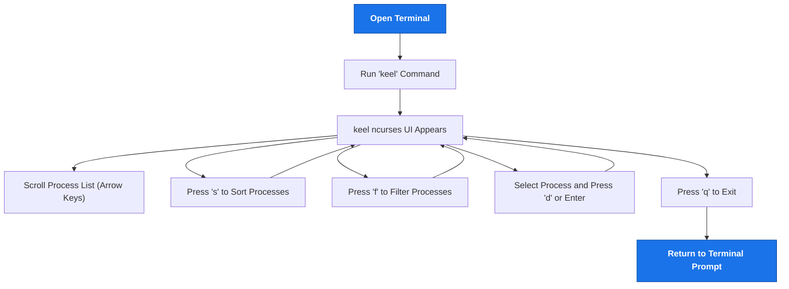

# Launching keel: Core Usage Workflow

Welcome to the core usage workflow of **keel** — a terminal-based process viewer and manager that puts live process data at your fingertips through a user-friendly ncurses interface. This guide walks you through launching keel, navigating its interface, and performing essential operations to gain live insights into your system’s process activity.

---

## 1. Workflow Overview

### What This Guide Helps You Accomplish
This tutorial helps you launch keel from the command line for the first time, explore the ncurses UI to monitor system processes, and interact with live process data efficiently. It is designed for newcomers aiming to familiarize themselves with keel’s core runtime interaction.

### Prerequisites
- keel installed on your system following the [Installing keel](../../guides/getting-started/installation) instructions.
- Access to a terminal or shell environment.
- Basic familiarity with command-line operations.

### Expected Outcome
By completing this guide, you will be able to:
- Start keel and understand its primary command-line options.
- Navigate the ncurses interface to browse processes.
- Perform essential UI operations such as sorting and filtering.
- Interpret live process details to troubleshoot or monitor system behavior.

### Time Estimate
10 to 15 minutes.

### Difficulty Level
Beginner-friendly.

---

## 2. Step-by-Step Instructions

<Steps>
<Step title="Launching keel from the Command Line">
Open your terminal and run the basic `keel` command:

```bash
keel
```

**Expected result:** keel will start, displaying the ncurses interface with a live list of processes.

**Tips:** Use `keel --help` to view available options if you want to customize startup behavior.
</Step>

<Step title="Exploring the Main Interface">
Once launched, observe the following UI components:
- **Process List:** Center pane shows active processes with details such as PID, CPU, memory usage.
- **Status Bar:** Bottom line displays current views, command hints, and system summary.

Use the arrow keys (↑, ↓) to scroll through the process list.

**Expected result:** Smooth scrolling and real-time updating of process metrics.

**Advice:** The interface refreshes periodically to reflect live system state.
</Step>

<Step title="Sorting Processes">
Press the `s` key to bring up the sort options.

Select sort criteria (e.g., CPU %, Memory %, PID) by pressing the corresponding key displayed in the sort menu.

**Expected result:** The process list reorders immediately based on the chosen criterion.

**Note:** Sorting helps prioritize processes by resource consumption or PID hierarchy.
</Step>

<Step title="Filtering the Process List">
Press the `f` key to open the filter prompt. Enter a user name, process name, or partial string to narrow down the process list.

Confirm by pressing Enter.

**Expected result:** The list displays only processes matching the filter criteria.

**Tip:** Use filters to quickly locate specific applications or services.
</Step>

<Step title="Viewing Detailed Process Info">
Select a process using arrow keys.

Press `Enter` or `d` to view detailed information such as command line arguments, open files, or resource usage.

**Expected result:** A details pane appears with extended live data.

**Advice:** Use this view for deep-dive investigation of problematic or suspicious processes.
</Step>

<Step title="Exiting keel">
Press `q` to quit the interface and return to the terminal prompt.

**Expected result:** Exit without disrupting system processes.

</Step>
</Steps>

---

## 3. Practical Examples

### Example 1: Launch keel and sort by memory usage

```bash
keel
```
- Press `s` then select `Memory %` to reorder showing top memory consumers on top.

### Example 2: Filter to show only processes by user "alice"

- Run `keel`.
- Press `f` and type `alice`, press Enter.
- Process list updates to show only Alice’s processes.

### Example 3: View details of a high-CPU process

- Scroll to a process with high CPU usage.
- Press `d` or Enter.
- Inspect CPU time, command line, and other metrics.

---

## 4. Troubleshooting & Tips

<AccordionGroup title="Common Issues While Launching and Navigating keel">
<Accordion title="keel Command Not Found">
Ensure keel was installed correctly. See [Installing keel](../../guides/getting-started/installation) for setup steps.
Verify the `keel` binary is in your PATH.
</Accordion>

<Accordion title="Interface Does Not Refresh or Displays Garbled Text">
Run `reset` in your terminal to restore terminal state.
Use terminal emulators that support ncurses (e.g., xterm, gnome-terminal).
</Accordion>

<Accordion title="Unresponsive Keys in UI">
Make sure your keyboard input focus is on the terminal window.
Check if your terminal sends standard keycodes.
</Accordion>
</AccordionGroup>

<Tip>
Sort and filter frequently to tailor the display to your needs—this expedites process identification.
</Tip>

<Tip>
Press `h` within the keel UI at any time to access the built-in help screen listing key commands.
</Tip>

---

## 5. Next Steps & Related Content

- After mastering basic launch and navigation, advance to [Filtering Processes by User](../../guides/process-management/filter-users) to target users' processes.
- Learn how to [Kill Processes from the Interface](../../guides/process-management/process-control) to manage system resources.
- Explore [Command-Line Parameters and Help](../../guides/getting-started/help-and-parameters) for extending keel’s functionality.

---

## Summary Diagram of the Core Usage Workflow



---

For detailed installation steps and prerequisites, visit the [Installing keel guide](/guides/getting-started/installation).

If you encounter startup issues, review [Troubleshooting Startup & Usage](/getting-started/first-steps/common-setup-issues).

Enjoy real-time insight and control over your system’s processes with keel’s straightforward yet powerful interface.

---

_Last updated with keel version aligned with the main branch._

<Check>Follow this guide carefully to get comfortable with keel’s interface; mastery here unlocks powerful system monitoring and management capabilities.</Check>
