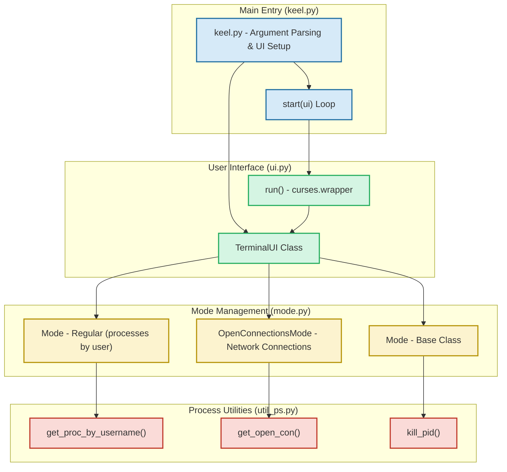

# Architecture Overview (with Diagram)

## Visualizing keel's Core Architecture

Understanding keel’s architecture empowers you to grasp how its components work together seamlessly, from launching the program to interacting with running processes via the terminal interface. This overview reveals the flow of control and data between the main Python entry point, the user interface, mode management, and process utilities.

### How keel Operates: A User-Centric Flow

1. **Launching keel**
   - The process begins with the user invoking the `keel.py` script with required parameters: the username (`-u`) and the mode (`-m`). This sets the context for which processes are displayed and how they’re managed.

2. **Setting up the User Interface (UI)**
   - `keel.py` initializes an instance of the `TerminalUI` class, defined in `ui.py`. This component is responsible for rendering the terminal interface using curses.
   - It configures the UI based on the provided user and mode, setting state accordingly.

3. **Mode Management**
   - keel supports different operational modes:
     - **Regular mode:** Lists system processes owned by the specified user.
     - **Connections mode:** Displays active network connections (TCP, UDP, etc.) associated with the user.
   - These modes are implemented as classes deriving from a base `Mode` class in `mode.py`. The UI delegates process fetching and killing logic to the current mode instance.

4. **Fetching and Displaying Processes**
   - Mode classes use utilities from `util_ps.py` to fetch live system information:
     - Processes by username
     - Open network connections
     - Process kill functionality
   - The UI then lists these items interactively, allowing users to navigate and highlight entries.

5. **User Interaction and Process Control**
   - Via keyboard navigation, the user highlights entries and can press the Enter key to kill the selected process.
   - Upon this action, the UI invokes the mode’s kill method, which attempts process termination using system utilities.
   - The interface updates immediately to reflect the change, keeping the interaction fluid and efficient.

6. **Mode and User Switching**
   - Although under development, keel plans to support runtime switching of modes and monitored users, enhancing flexibility.


### Architecture Components and Relationships




### Why This Architecture Matters to You

- **Simplicity and Focus:** The architecture cleanly separates responsibilities. The main entry handles setup, the UI manages display and interaction, modes encapsulate different data views and actions, and utilities connect to the system process layer.

- **Extensibility:** Adding new modes or user filters is straightforward. Each mode is a self-contained unit responsible for its data and behaviors.

- **Responsive User Interaction:** The curses-based UI ensures that your key actions (highlight, kill) are immediately reflected, making process management fast and intuitive.

- **Robust Process Control:** Using `psutil` under the hood ties keel’s process and connection handling to a well-supported Python library, increasing stability and cross-platform potential.


### Practical Tips for Using This Architecture

- Always specify a valid username with `-u` when launching keel to ensure processes are filtered correctly.
- Choose the mode (`regular` or `connections`) based on whether you want to list system processes or network sockets.
- Use the arrow keys to navigate and press Enter to terminate a highlighted process or connection.
- Pressing `q` exits the program safely.
- Keep an eye on the title bar to confirm the current user and mode.


### Next Steps

- Explore the [Core Concepts & Terminology](../keel-overview/core-concepts-architecture/keel-concepts-terminology) page to deepen your understanding of terms and workflows used throughout keel.
- Review the [Quick Feature Overview](../keel-overview/core-concepts-architecture/key-features-preview) for a feature-focused lens.
- Proceed to [Installation & Dependencies](../../integration-getting-started/installation-dependencies) to set up keel in your environment and start using it immediately.


---

For more about keel’s purpose and value, visit the [What is keel?](../introduction-and-value/what-is-keel) and [Product Value & Key Benefits](../introduction-and-value/why-use-keel) pages.


---

## Sample Command to Start keel

```bash
python3 keel.py -u root -m regular
```

This launches keel showing regular processes for the `root` user.


---

## Troubleshooting Highlights

- If no processes appear, verify the username parameter correctness.
- Trying to kill a process may fail if you lack permissions; ensure you have appropriate rights.
- The program exits if no processes remain in the current view.


---

This architecture overview equips you with a clear mental model of how keel operates under the hood, setting you up for effective usage and exploration of its powerful, streamlined process management capabilities.


---

## Source and Contribution

For full source code examination or contributions, visit the [keel GitHub repository](https://github.com/modelorona/keel).


---

