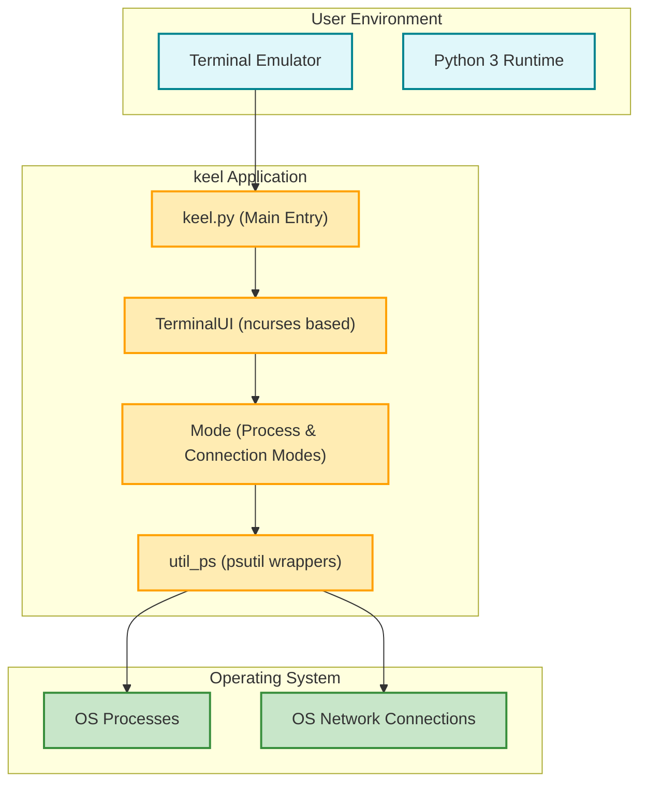

# Integration & Dependencies

## Seamless Integration with Your System Environment

keel is designed as a lightweight, terminal-based Python 3 application that integrates directly with your operating system's process and network management APIs. Leveraging the `psutil` library, keel interacts deeply with OS-level process data and network connections, enabling you to view and manage both system processes and active network connections from a unified interface.

By running within a terminal using the powerful `ncurses` framework, keel ensures smooth user experience in command-line environments, making it ideal for administrators and developers who need rapid, reliable process control without a heavy graphical interface.

### Why This Matters to You

- **Responsive OS-Level Interaction:** keel directly queries and manipulates processes and connections using Python's `psutil` library, ensuring accurate, real-time data from your system.
- **Terminal-Based Simplicity:** Through `ncurses`, keel offers a rich interface without leaving your terminal, streamlining workflow without the need for GUI overhead.
- **Flexible User & Mode Control:** You can specify the targeted user and operational mode (processes or connections) right from the start, tailoring the tool to your exact use case.

## Key Dependencies

To use keel effectively, your environment should meet specific technical prerequisites. Below is an outline of the essential dependencies and setup considerations.

| Dependency        | Purpose                                           | Notes                          |
|-------------------|--------------------------------------------------|--------------------------------|
| **Python 3**       | Core language runtime                             | keel is developed with Python 3, so ensure your environment has Python 3.x installed.
| **psutil**         | System process and network interaction           | Enables fetching process lists, killing PIDs, and inspecting network connections.
| **ncurses (curses)**| Terminal UI management framework                  | Powers the interactive terminal user interface keel uses.
| **pip installation**| For easy installation and management of keel     | keel can be installed via pip for straightforward setup.

### Installation via pip

You can install keel from PyPI using the following command:

```bash
pip install keel
```

This installs keel and its Python dependencies, including `psutil`.

## How keel Integrates with System Workflows

keel operates by calling OS-level APIs through the `psutil` Python library, which abstracts system process and network connection details in a cross-platform manner. keel queries these APIs to:

- Gather lists of processes by user or all system processes
- Enumerate active network connections filtered by type (TCP, UDP, etc.)
- Perform process termination operations safely by PID

These operations happen in real time and are reflected immediately in keel's terminal interface, bridging system internals with an accessible, keyboard-driven UI.

### Interaction Examples

- When you specify a username, keel lists only those processes owned by that user, retrieved via `psutil.process_iter` filtering on `username`.
- In `connections` mode, keel fetches all open network connections of specific types (e.g., `inet`) to display ongoing TCP or UDP sessions.
- Upon user command, keel terminates processes by sending kill signals through native OS calls wrapped by `psutil`.

### Practical Workflow Scenario

Imagine you're diagnosing system resource usage on a remote server via SSH. keel lets you:

1. Launch the tool specifying the user you want to monitor.
2. Navigate the list of processes or network connections entirely from the keyboard.
3. Instantly kill problematic or unauthorized processes without leaving the terminal.

This streamlined process greatly accelerates incident response and routine system maintenance.

## Important Technical Considerations

- keel explicitly prevents killing its own process to avoid accidental termination.
- The tool relies on `ncurses` for rendering the UI, which means it must be run in a supported terminal environment.
- You must have adequate system permissions to view or terminate processes owned by users other than yourself.

<Tip>
If you encounter permission errors, consider running keel with elevated privileges or adjust user permissions accordingly.
</Tip>

## Summary Diagram of Dependencies and Interaction



## Getting Started Tips

- Before running keel, ensure Python 3 and `psutil` are installed.
- Install via pip for simplified setup.
- Run keel with `-u <username>` and `-m <mode>` parameters, e.g., `python3 keel.py -u root -m regular`.
- The modes are `regular` for process listing and `connections` for viewing network connections.

For deeper setup information, see [System Requirements & Prerequisites](../getting-started/setup-installation/system-requirements) and [Installing keel](../getting-started/setup-installation/installing-keel).

---

## Troubleshooting Common Dependency Issues

<AccordionGroup title="Troubleshooting Dependency & Integration Issues">
<Accordion title="Permission Errors When Running keel">
If you see errors related to accessing process or network information, it may be due to insufficient permissions. Try launching keel with elevated privileges (e.g., using `sudo`) or ensure your user has permissions to management target processes.
</Accordion>
<Accordion title="Missing psutil or curses Modules">
Ensure you have installed all dependencies. Running `pip install keel` automatically installs `psutil`. The `curses` module is typically included in Python standard library on UNIX-based systems; for Windows, you might need additional setup or use Windows Subsystem for Linux (WSL).
</Accordion>
<Accordion title="Terminal Display Issues">
keel depends on a terminal that supports `ncurses`. Running inside unsupported terminals (e.g., basic Windows CMD without enhancements) might cause display errors. Using proper terminal emulators like `xterm`, `gnome-terminal`, or WSL terminals is recommended.
</Accordion>
</AccordionGroup>

---

> This documentation page fits within the Architecture & Core Concepts section of keel's docs, building upon fundamental concepts and complementing the full system overview. For user-centric operation workflows, consult [Core Concepts & Terminology](./core-concepts-terminology) and for installation specifics see Getting Started guides.

---

## References

- Source code for system interaction: [`util_ps.py`](https://github.com/modelorona/keel/blob/main/keel/util_ps.py)
- Main entry and UI flow: [`keel.py`](https://github.com/modelorona/keel/blob/main/keel/keel.py), [`ui.py`](https://github.com/modelorona/keel/blob/main/keel/ui.py)
- `psutil` library documentation: https://psutil.readthedocs.io/

---

**Next Steps:** Proceed to [System Architecture Overview](./system-overview-diagram) to visualize how these components interact, or jump to [Installing keel](../../getting-started/setup-installation/installing-keel) to prepare your environment for first use.


---