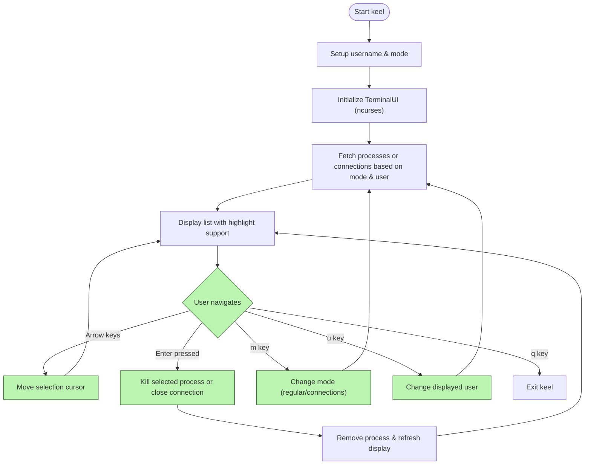

# Core Features at a Glance

## Unlock Powerful Process and Connection Management in a Unified Terminal Interface

keel offers a streamlined, keyboard-driven experience to monitor and control system processes and network connections directly from your terminal. Designed for security professionals, system administrators, and power users, keel merges powerful capabilities into a single ncurses-based interface — making process management faster, clearer, and more efficient.

### Key Feature Highlights

- **Dynamic Process Listing:** Displays active processes filtered by user or connection type, letting you easily scan, identify, and focus on relevant tasks.
- **Intuitive ncurses Interface:** Terminal UI leverages keyboard navigation and color highlighting to offer responsive interaction without the overhead or distractions of GUIs.
- **One-Key Process Termination:** Kill any highlighted process instantly with the enter key to quickly respond to rogue or unneeded processes.
- **User & Mode Filtering:** Switch between different users and operational modes (‘regular’ system processes or ‘connections’ for network sockets) to tailor the information displayed.
- **Network Connection Visualization:** View detailed open network connections of various kinds (tcp, udp, unix sockets) to monitor active communications and identify connection-based issues.

### Who Benefits?

System administrators aiming to maintain control over active system resources, security teams hunting suspicious processes or connections, and developers managing needs across multiple user contexts will find keel indispensable.

---

## What You Can Do With keel’s Core Features

keel transforms your terminal into a powerful process management dashboard that helps you:

- **See processes relevant to specific users:** Focus on the user's own processes or switch views dynamically.
- **Identify network connections live:** Monitor active TCP, UDP, and UNIX socket connections right alongside processes.
- **Act quickly with keyboard-driven controls:** Use arrow keys to navigate, `Enter` to kill highlighted processes, and shortcuts to switch modes or users.
- **Visualize process states clearly:** Color highlights, centered titles, and clean layout avoid clutter and support rapid scanning.

---

## Feature Walkthrough with Real Scenarios

### Dynamic Process Listing by User or Mode

By default, keel lists processes owned by a specified user, designed for rapid assessment and targeted action.

Example: You want to review all processes run by user `alice`. keel populates the screen with process entries like `2345 : sshd` or `7890 : python3`.

Switching to connections mode lets you see open sockets, such as `tcp4` or `udp6` connections, showing active network traffic in real time.

### Keyboard Navigation and Highlighting

Navigate the list using arrow keys. As the cursor moves, the current row is visually highlighted, helping you keep focus.

Example: Pressing the down arrow moves selection to the next process; when you reach the bottom of the visible list, keel smartly scrolls the entries up or down to keep your selection visible.

### One-Key Kill Action

Press `Enter` on the highlighted process or connection to terminate it immediately.

Example: You spot a runaway process `1234 : some_script.py` and hit `Enter`. keel sends a kill signal, removes it from the list, and shifts remaining entries up seamlessly.

<Tip>
Always ensure you have permissions to kill a process and double-check the highlighted process before confirming to avoid unintended shutdowns.
</Tip>

### Mode and User Switching

Dedicated keystrokes (`m` for mode and `u` for user) intend to let you quickly change the data displayed. While under active development, these features promise flexible workflow adjustments without restarting the app.

Example: Press `m` to switch from process view to network connections or `u` to enter a different username to see that user’s processes instantly.

---

## Practical Tips and Best Practices

- Start keel with explicit user (`-u`) and mode (`-m`) parameters to tailor the initial view to your needs.
- Use arrow keys to swiftly browse long process or connection lists.
- Use the centered, bold red title bar as your mode and user status reference.
- Remember to press `q` to exit gracefully.

---

## Common Pitfalls and Troubleshooting

- If no processes appear, verify the user name is correct. keel defaults to `root` if unspecified.
- Killing processes may fail if you lack permissions; consider running keel with elevated privileges if safe.
- The UI might not refresh correctly if run in terminals that do not fully support ncurses.

---

## Summary

keel’s core features ensure you can efficiently monitor, filter, and control system processes and network connections all from a singular, easy-to-navigate terminal UI:

- Processes listed by user or mode
- Keyboard-driven selection and control
- Real-time kill functionality
- Planned dynamic switching between users and views

This cohesive feature set addresses the primary needs of administrators and security operators who require fast, low-overhead system control tools.


---

## Getting Started

To start using keel’s core features, launch the tool specifying a username and mode:

```bash
python3 keel.py -u alice -m regular
```

Replace `alice` with your user of interest and `regular` with `connections` to see open network connections.

Explore navigation with arrow keys and kill processes using `Enter`. Exit anytime with `q`.


---

## See Also

- [What is keel?](overview/getting-started/product-intro) — Overview and product introduction
- [Running keel for the First Time](getting-started/first-steps/running-keel) — How to launch and configure
- [Filtering Processes by User](guides/process-management/filter-users) — Deeper dive into user filtering
- [Viewing Network Connections](guides/process-management/view-connections) — Explore connection monitoring
- [Killing Processes from the Interface](guides/process-management/process-control) — Actions and control workflows


---

# Diagram: keel Core Feature Interaction Flow


